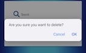

# Life in Blog
[View live project Here](https://life-in-blog-cd65fb4d61a0.herokuapp.com/)
***

Life in Blog is a user centric app designed to enable users to follow and extract inspiration from others life experiences. Users can blog their life experiences, be it travel, food, books, film or day to day life. A tough life experience blog for others may help to avoid a pitfall in the road. Life in Blog allows users to write about all of lifes experiences, ups and downs.  

- [Blog Website](#blog-website)
- [User Experience UX](#user-experience-ux)
  - [UX-strategy](#ux-strategy)
  - [UX-scope](#ux-scope)
  - [UX-structure](#ux-structure)
  - [UX-skeleton](#ux-skeleton)
  - [UX-surface](#ux-surface)
- [Technologies-used](#technologies-used)
- [Testing](#testing)
- [Deployment](#deployment)
- [Credits](#credits)

# User Experience UX

## UX-strategy

The goal is to provide a blog website for users to blog their thoughts and feelings on various subjects from books, tv shows to day to day life. 

**Developer Goals**
- Build portfolio: 
- Develop technical skills:

The MVP of this project is simple but the app can be developed to include commenting on other blogs, celebrating the blog content, including images and potential monetisation through advertising or affiliate links. 

**User Goals**
- Access to information and inspiration, what book will they read next or where will they travel to?
- Passing time reading content.
- Seemless Navigation
- Sharing content/Post their thoughts and feelings on a variety of subjects. 
- Search blogs for a specific user or content. 
- Responsive design. Can be accessed on the go. 

**User Stories**

_As a FIRST TIME user of the site I want to be able to:_
- Intuitively and easily navigate the site
- Browse blog content
- Register as a user
- Logout of the site

_As a RETURNING user of the site I want to be able to:_
- Login and out of the site.
- Easily filter to my favourite blogger
- Write my own blogs
- Edit/Update my blogs
- Delete my blogs
- Comment on other users blogs

_As an admin of the site I want to be able to:_
- Edit or Delete all Blogs
- Manage the blog categories
- Delete comments from all users

## UX-scope

**Existing Features**

**Home Page**

.png)

**Nav Bar**

Links available within the navbar vary dependent on access. 

_Logged Out_

.png)

_Logged In_

.png)

_Admin_

.png)

**Logo**

**Search Feature**

Search allows users to search by username, category, or keywords from the title and/or content of the blog. 

**Blog Feed**

Blog feed displays the most recent by date created at the top of the feed. In future I could expand this to log the time and date the post is created to curate the display further. 

**Footer**

**Register Page**

**Login Page**

**Profile Page**

**Logout**

**Administrator Features**
- Manage Categories

- Delete Blogs

- Delete Comments

**Commenting on blogs**

I decided to avail of the flexibility of a non relational database by simply storing comments in an array within the blog object. To maintain visibility of which user commented without relating directly back to the user object within the database I pushed the username to the database as part of the comment. 

**CRUD Functionality**

User receives feedback when actions are complete and is asked to confirm before deletion. 

.png)

_Create:_ 
I can create user account, blog posts and comments. 

_Read:_ 
I can read all user blogs and comments

_Update:_
I can update my own blogs

_Delete:_
I can delete my own blogs. 

Additionally as an admin I can also:
CRUD - categories, all blogs and all comments. 

**Future Improvements**
- **Contact page**
Allow users to contact site admin to suggest improvements or with issues. 
- **Ability to celebrate Blogs** 
Allow users to celebrate or acknowledge their appreciation of a blog without commenting. 
- **Reset password function**
Allow users to reset their passwords and be reminded of their user name via email. 

## UX-structure

- All functions are displayed to the relevant users dependant on login/admin status. 
- Submit buttons are provided at all points of creation, ie registration, new blog, new comment, new category, editing a blog. 
- Cancel and reset buttons are provided where appropriate to avoid the need to use browser controls. 
- Pop out accordiation is used to read blog content. 
- To see comments users can click on the accompanying comment button on each blog. 

**Logo**

Is consitantly displayed at the top of every page to allow users a quick return to the homepage. 

**Navigation**

I have decoded to use a traditional navigation bar with links displaying to the relevant users.
Not logged in users will see - Home, Login and Register
Logged in users will see - Home, Logout, New Blog, Profile
Admin users will see - Home, Logout, New Blog, Profile and manage categories. 

The Navigation bar collapses into a hamburger icon which users are familiar with on mobile devices. 

**Footer**
I decided to use a traditional footer with a link to my github repository. 

**Data Structure**

Once I had MVP complete I decided to add the additional functionality of commenting on blogs. I availed of the flexibility of a non relational DB. storing the comments as an array within the blog object. 

## UX-skeleton

**Design Choices**

**Wireframes**

[View Wireframes](wireframes.md)

## UX-surface

**Colour Palette**

**Fonts**

**Responsiveness**
I will rely upon a combination of materialize and media queries to ensure the app was was visually appealing and well laid out on all screens. 

# Technologies-used
- **Libraries:** jQuery, Materialize, Flask
- **Languages:** HTML, CSS, JavaScript, Python
- **Database Management:** MongoDB
- **Gitpod:** used as a cloud code editor.
- **GitHub:** used as a cloud based code repository.
- **Heroku:** was used to deploy the app. 

# Testing 
[View Testing Documentation](testing.md)

# Deployment
The Website has been deployed using Heroku [Here](https://life-in-blog-cd65fb4d61a0.herokuapp.com/) using the method below:

- I logged into my Heroku Account. 
- I clicked on New and choose 'Create New App'
- I choose a unique name for my app and set the region to Europe. 
- I then chose Github as the deployment method and searched for my repo name. 
- I then clicked on settings and  updated the config variables. 
- I navigated back to the deploy and enabled automatic deployment. 

# Credits
**Content**

- [Materialise Version 1.0.0](https://materializecss.com/about.html)
- I used [mycolor.space](https://mycolor.space/) to decide on the colour scheme of the site.
- Icons were sourced from [Font Awesome](https://fontawesome.com)
- My fonts were taken from [Google Fonts](https://fonts.google.com/)
- Wireframes were created using [Balsamiq](https://balsamiq.com/)
- Database schematic was created using [Lucid Chart](https://www.lucidchart.com) 

**Code**
- I learned how to format the date within my Python function from [this site ](https://stackoverflow.com/questions/62762873/current-date-time-in-a-particular-format-python) 
- I learned how to delete an object from an array in MongoDB in the documentation [here](https://www.mongodb.com/docs/manual/reference/operator/update/pull/#:~:text=If%20the%20specified%20to,exact%20same%20fields%20and%20values.)
- While developing this project I referred back to code I had written during the task manager mini project.

**Advice**

I would like to thank my mentor for his help and support during this project espcially but not limited to challenging me to amend my logic to solve bugs within functions. 

