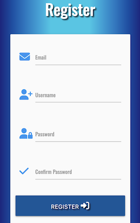
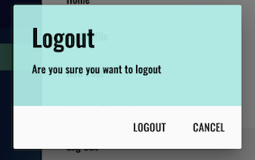
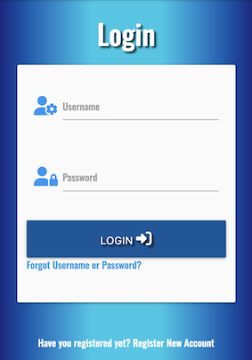
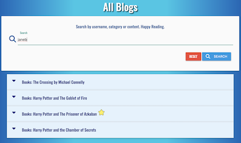
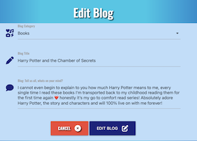
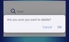
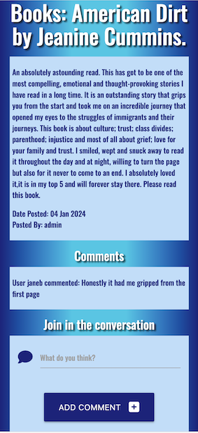
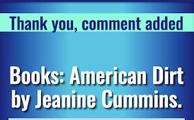
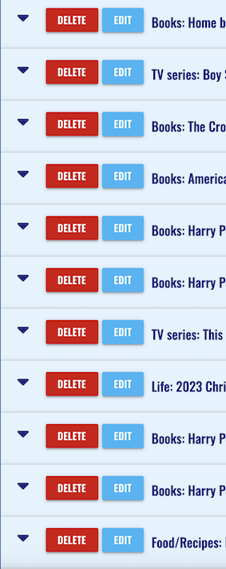
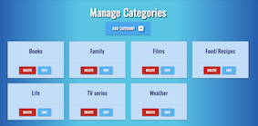

# Testing

[Return to README](README.md)

## Contents

[Manual Testing](#manual-testing) \
[User Story Validation](#user-story-validation) \
[Lighthouse Audit](#lighthouse-audit) \
[Validator Testing](#validator-testing)\
[Bugs](#bugs)

## Manual Testing

**Device and Browser Testing**

|**Testing** |**iPhone12 safari** |**iPad Pro 9.7" safari**|**MacBook Air Chrome**|**MacBook Air Safari**|**Lenovo MS OS Edge**|**Lenovo MS OS Edge**|**Chrome Developer Tools**|
|-----|-----|-----|-----|-----|-----|-----|-----|
|Responsive|
|Delete/Edit buttons visible to owner user|
|Forms won't submit without appropriate information| Yes | Yes|Yes|Yes|Yes|Yes|Yes|
|User Flash messages appear|Yes|Yes|Yes|Yes|Yes|Yes|Yes|
|Choose category from drop down list on blog form|No||Yes|Yes|Yes|Yes|Yes|

|**Additional Devices Tested Using Chrome Developer Tools**|**Responsive Observations**
|-----|-----|
|Galaxy S9+|
|Galaxy S20 Ultra|
|Pixel 5|
|iPad Air|
|iPad Mini|
|Surface Pro 7|
|Responsive widths to assess breakpoint issues|

**Manual Testing of User Actions**

|**Feature**     |**Action**     |**Expected Behaviour**     |**Result**     |
|----------------|---------------|---------------------------|---------------|
|Nav Bar|Click Logo|Navigates to home page|Pass|
|Nav Bar|Click Home|Navigates to home page|Pass|
|Nav Bar|Click Register|Navigates to registration page|Pass|
|Nav Bar|Click Login|Navigates to login page|Pass|
|Nav Bar|Click My Profile|Navigates to profile page|Pass|
|Nav Bar|Click Logout|Asks user to confirm logout|Pass|
|Nav Bar|Click New Blog|Navigates to new blog page|Pass|
|Nav Bar|Click Manage categories|Navigates to manage categories page|Pass|
|Nav Bar - Mobile|Click hamburger icon|Expands Navigation on right side of screen|Pass|
|Nav Bar - Mobile|Click Home|Navigates to home page|Pass|
|Nav Bar - Mobile|Click Register|Navigates to registration page|Pass|
|Nav Bar - Mobile|Click Login|Navigates to login page|Pass|
|Nav Bar - Mobile|Click Logout|Asks user to confirm logout|Pass|
|Nav Bar - Mobile|Click New Blog|Navigates to new blog page|Pass|
|Nav Bar - Mobile|Click Manage categories|Navigates to manage categories page|Pass|
|Search Function - Homepage|Type search word press enter|Returns appropriate Blogs or No results found|Pass|
|Search Function - Homepage|Type search word click Submit|Returns appropriate Blogs or No results found|Pass|
|Reset Button - homepage|Click reset button|Clears the search bar and reloads all blogs|Pass|
|Accordion - Homepage |click on blog|expands one blog at a time|Pass|
|Delete Button|Click Delete button|Asks user to confirm deletion|Pass|
|Edit Button|Click Edit Button|redirects user to the edit blog screen which is filled with the current blog content|Pass|
|Footer|Click Github logo|Opens Jane McKennas github in a new window|Pass|

## User Story Validation

|**User Story**|**Outcome**|**Screengrabs**|
|-----|-----|-----|
|**_FIRST TIME User_**|
|Intuitively and easily navigate the site|Layout is traditional and intuitive with a familiar navigational layout|.png) .png) |
|Browse blog content|I am able to view and browse content from users on the homepage without registering. After logging in I can also see my own profile with my blogs|.png)|
|Register as a user|I can register a new account easily and intuitively| |
|Logout of the site|I can logout of the site and am asked to confirm that I want to| |
|**_RETURNING user_**|
|Login and out of the site.|I can log in and out of the site easily| |
|Easily filter to my favourite blogger|I can use the search function to search by my favourite bloggers username| |
|Write my own blogs|I can write my own new blogs and receive visual confirmation that the blog was added|.png) |
|Edit/Update my blogs|I can amend my own blogs if i wish to.| |
|Delete my blogs|I can delete my own blogs if I wish to and am asked to confirm before deletion| |
|Comment on other users blogs|I can add comments to all blogs|  |
|**_Admin user_**|
|Edit or Delete all Blogs|As an admin user I can edit and/or delete blogs from any user||
|Manage the blog categories|As an admin user I can add, edit or delete categories| |
|Delete comments from all users|As an admin user I can delete comments from any user||

## Lighthouse Audit

## Validator Audit

## Bugs

|**Bug**|**Resolution**|
|-----|-----|
|Logo not showing on Profile Page|Forgot to use the jinga templating to reference the img file. Only erroring on the profile page as the page required additional parameters to be passed through|
|Non registered user attempted login - errored|I had refactored my login code to check is the user was 'is_admin' but I hadn’t tested it with a non registered user, I had to change the order of the function to allow the flash to the non registered user|
|Confirmation of deletion - modal not displaying and/or error|When attempting to reuse my modal to display confirmation of deletion I encountered an issue with passing through the object_id. I have a temporary workaround using js onclick method while I establish why the object_id won't pass though the modal. Through trial and error I fixed this error by positioning the modal code next to the button|
|Search on profile page redirecting back to home page|I had reused code for the search and on testing realised I was still directing back to the home page. When I corrected this code I realised that as the length of blogs > 0 if you search for a term that exists in another users blog no blogs appear but the No results found message doesn’t appear. I worked out a solution from reading [this](https://www.w3schools.com/python/python_mongodb_query.asp) and [this](https://blog.enterprisedna.co/python-filter-list-5-practical-methods-explained/#:~:text=You%20can%20filter%20object%20by,each%20element%20in%20the%20iterable.) within the search function for the profile I first queried the database creating a list of all the blogs containing the search parameters then filtered that list to just items where the user equal to the username.|
|On the deployed site when a non admin attempted to log out, a session cookie for admin was not found and threw and error.|I found a solution [here](https://www.techwithtim.net/tutorials/flask/sessions). Which instructs what to do if the key in this case admin doesn’t exist. Which solved the problem.|
|When testing with iOS 13 I noticed that there was an issue with selecting the category on the form, I couldn't figure out why but I found [this](https://stackoverflow.com/questions/60307437/materializecss-select-native-for-ios-android) and [this](https://github.com/Dogfalo/materialize/issues/6464) online which references an issue with materialize and iOS, I attempted the workaround suggested with browser-default class but it caused an issue on desktop.||

[Return to README](README.md)
