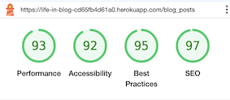
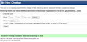
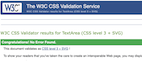

# Testing

[Return to README](README.md)

## Contents

[Manual Testing](#manual-testing) \
[User Story Validation](#user-story-validation) \
[Lighthouse Audit](#lighthouse-audit) \
[Validator Testing](#validator-testing)\
[Bugs](#bugs)

## Manual Testing

**Device and Browser Testing**

|**Testing** |**iPhone12 safari** |**iPad Pro 9.7" safari**|**MacBook Air Chrome**|**MacBook Air Safari**|**Lenovo MS OS Edge**|**Lenovo MS OS Edge**|**Chrome Developer Tools**|
|-----|-----|-----|-----|-----|-----|-----|-----|
|Responsive|
|Delete/Edit buttons visible to owner user|
|Forms won't submit without appropriate information| Yes | Yes|Yes|Yes|Yes|Yes|Yes|
|User Flash messages appear|Yes|Yes|Yes|Yes|Yes|Yes|Yes|
|Choose category from drop down list on blog form|Yes|Yes|Yes|Yes|Yes|Yes|Yes|

|**Additional Devices Tested Using Chrome Developer Tools**|**Responsive Observations**
|-----|-----|
|Galaxy S9+|
|Galaxy S20 Ultra|
|Pixel 5|
|iPad Air|
|iPad Mini|
|Surface Pro 7|
|Responsive widths to assess breakpoint issues|

**Manual Testing of User Actions**

|**Feature**     |**Action**     |**Expected Behaviour**     |**Result**     |
|----------------|---------------|---------------------------|---------------|
|Nav Bar|Click Logo|Navigates to home page|Pass|
|Nav Bar|Click Home|Navigates to home page|Pass|
|Nav Bar|Click Register|Navigates to registration page|Pass|
|Nav Bar|Click Login|Navigates to login page|Pass|
|Nav Bar|Click My Profile|Navigates to profile page|Pass|
|Nav Bar|Click Logout|Asks user to confirm logout|Pass|
|Confirm Logout|Click Logout |Flash: 'You have been logged out' and returned to Login Page|Pass|
|Confirm Delete|Click Cancel|Returned to previous Page|Pass|
|Nav Bar|Click New Blog|Navigates to new blog page|Pass|
|Nav Bar|Click Manage categories|Navigates to manage categories page|Pass|
|Nav Bar - Mobile|Click hamburger icon|Expands Navigation on right side of screen|Pass|
|Nav Bar - Mobile|Click Home|Navigates to home page|Pass|
|Nav Bar - Mobile|Click Register|Navigates to registration page|Pass|
|Nav Bar - Mobile|Click Login|Navigates to login page|Pass|
|Nav Bar - Mobile|Click Logout|Asks user to confirm logout|Pass|
|Nav Bar - Mobile|Click New Blog|Navigates to new blog page|Pass|
|Nav Bar - Mobile|Click Manage categories|Navigates to manage categories page|Pass|
|Search Function - Homepage|Type search word press enter|Returns appropriate Blogs or No results found|Pass|
|Search Function - Homepage|Type search word click Submit|Returns appropriate Blogs or No results found|Pass|
|Reset Button - homepage|Click reset button|Clears the search bar and reloads all blogs|Pass|
|Accordion - Homepage |click on blog|expands one blog at a time|Pass|
|Home Page - Comments Button (Logged in)|Click on comments button|Opens corresponding blog comments page with form to comment visable|Pass|
|Home Page - Comments Button (Logged out)|Click on comments button|Opens corresponding blog comments page with 'Login to join the conversation text'|Pass|
|Delete Button|Click Delete button|Asks user to confirm deletion|Pass|
|Confirm Delete|Click Delete|Flash Blog successfully Deleted|Pass|
|Confirm Delete|Click Cancel|Returned to Previous Page|Pass|
|Edit Button|Click Edit Button|redirects user to the edit blog screen which is filled with the current blog content|Pass|
|Footer|Click Github logo|Opens Jane McKennas github in a new window|Pass|
|Register Page|Click Register without providing Email details |Pop up: Please Fill in this Field |Pass|
|Register Page|Click Register without providing Username greater than 5 characters|Pop up: Please Fill in this Field or Please lengthen this text to 5 characters or more |Pass|
|Register Page|Click Register with non email text in email field|Pop up: Please include an '@' in the email address |Pass|
|Register Page|Type passwords that do not match|Red text under password confirm that indicates passwords dont match |Pass|
|Register Page|Type passwords that match|Green text under password confirm that indicates passwords match |Pass|
|Register Page|Click Register when passwords do not match|Flash passwords did not match|Pass|
|Register Page|Click Register email that exisits in DB|Flash email already exists |Pass|
|Register Page|Click Register username already in DB|Flash username already exists|Pass|
|Register Page|Type passwords with special characters|Pop up: Please match the format requested |Pass|
|Register Page|Click on Login link|Redirect to login page|Pass|
|Login Page|Login within user name that does not exist|Flash incorrect username and/or password|Pass|
|Login Page|Login within incorrect password|Flash incorrect username and/or password|Pass|
|Login Page|Login with correct username and password|Redirect to profile page of user with welcome message|Pass|
|Login Page|Click on register link|Redirect to Register page|Pass|
|Profile Page|Search term that exists in my blogs - Press Enter|Blogs containing term are returned|Pass|
|Profile Page|Search term that exists in my blogs - Click Search button|Blogs containing term are returned|Pass|
|Profile Page|Search term that exists other users blogs but not mine - Press Enter|No results found returned|Pass|
|Profile Page|Search term that exists other users blogs but not mine - Click Search button|No results found returned|Pass|
|Profile Page|Search term that does not exist in any blogs - Press Enter|No results found returned|Pass|
|Profile Page|Search term that does not exist in any blogs - Click Search Button|No results found returned|Pass|
|Profile Page|Click Reset button|All of my blogs are displayed|Pass|
|Profile Page - Delete Button|Click Delete button|Asks user to confirm deletion|Pass|
|Confirm Delete|Click Delete|Flash Blog successfully Deleted|Pass|
|Confirm Delete|Click Cancel|Returned to Previous Page|Pass|
|Profile Page - Edit Button|Click Edit Button|redirects user to the edit blog screen which is filled with the current blog content|Pass|
|Profile Page - Comments Button|Click on comments button|Opens corresponding blog comments page|Pass|
|Profile Page|Click accordian on Blog|Blog content opens to read|Pass|
|Comment Page| Click add comment with typing comment|Pop up:Please fill in this field|Pass|
|Comment Page| Click add comment with comment less than 10 characters|Pop up:Please lengthen this text to 10 characters or more|Pass|
|Comment Page| Click add comment with valid comment > 10 characters|Comment is added to the comments section and Thank you flash message appears|Pass|
|Comment Page| Blog owner or admin users|Delete (comment) button is visable|Pass|
|Comment Page| Click Delete button|User asked to confirm deletion|Pass|
|Confirm Delete|Click Delete|Flash Comment successfully Deleted + corresponding comment is deleted|Pass|
|Confirm Delete|Click Cancel|Returned to Previous Page|Pass|
|New Post|Click Choose Category|Categories appear in drop down|Pass|
|New Post|Fail to choose Category click Add Blog|Pop up: Please select an item from the list|Pass|
|New Post|click Add Blog - no Blog title|Pop up: Please fill in this field|Pass|
|New Post|click Add Blog - no Blog content|Pop up: Please fill in this field|Pass|
|New Post|Click Add Blog - all fields complete|Flash: Thank you Blog added succesfully|Pass|
|Manage Categories|Click Add Category|Redirected to Add Category|Pass|
|Add Category|Click Add Category - blank field|Pop up: Please fill in this field|Pass|
|Add Category|Click Add Category - completed field|Flash New Category Added and Category appears on the Category list|Pass|
|Add Category|Click Cancel |Returned to the Manage Categories Page|Pass|
|Manage Categories|Click Delete|User asked to Confirm Deletion|Pass|
|Confirm Delete|Click Delete|Flash Category Deleted and removed from category list|Pass|
|Confirm Delete|Click Cancel|Returned to the Manage Categories Page|Pass|
|Manage Categories|Click Edit|Edit category opens with Current category name pre populated|Pass|
|Manage Categories|Click Cancel|Returned to the Manage Categories Page|Pass|
|Manage Categories|Click Update Category|Flash Category Updated and updated on category list|Pass|

## User Story Validation

|**User Story**|**Outcome**|**Screengrabs**|
|-----|-----|-----|
|**_FIRST TIME User_**|
|Intuitively and easily navigate the site|Layout is traditional and intuitive with a familiar navigational layout|.png) .png) |
|Browse blog content|I am able to view and browse content from users on the homepage without registering. After logging in I can also see my own profile with my blogs|.png)|
|Register as a user|I can register a new account easily and intuitively| |
|Logout of the site|I can logout of the site and am asked to confirm that I want to| |
|**_RETURNING user_**|
|Login and out of the site.|I can log in and out of the site easily| |
|Easily filter to my favourite blogger|I can use the search function to search by my favourite bloggers username| |
|Write my own blogs|I can write my own new blogs and receive visual confirmation that the blog was added|.png) |
|Edit/Update my blogs|I can amend my own blogs if i wish to.| |
|Delete my blogs|I can delete my own blogs if I wish to and am asked to confirm before deletion| |
|Comment on other users blogs|I can add comments to all blogs|  |
|**_Admin user_**|
|Edit or Delete all Blogs|As an admin user I can edit and/or delete blogs from any user||
|Manage the blog categories|As an admin user I can add, edit or delete categories| |
|Delete comments from all users|As an admin user I can delete comments from any user||

## Lighthouse Audit

When I initally ran the lighthouse audit on some of the pages I had some accessibility issues, I added some aria labels and a hidden label for the category drop down. I also had to add in a meta desrciption tage into the head fro SEO. 

On final Lighthouse audits green results were returned on all pages. 

## Validator Audit

[W3C HTML validator](https://validator.w3.org/)

All Blogs(Home), Login, Register, New Blog, Comments pages pass through with no issues. 
Currently unnable to check profile and manage categories due to session cookies requirement. I have checked both by direct input and the errors returned relate to jinga templating language. 

[CSS validator Jigsaw](https://jigsaw.w3.org/css-validator/)

No errors found.

[JSHint](jshint.com)

Didnt return any errors but showed that $ was undefined, I was not concerned as it related to jQuery. 

[jsfiddle](https://jsfiddle.net/)

As this could be configured to include jQuery I also passed my js through without any issues. 

## Bugs

|**Bug**|**Resolution**|
|-----|-----|
|Logo not showing on Profile Page|Forgot to use the jinga templating to reference the img file. Only erroring on the profile page as the page required additional parameters to be passed through|
|Non registered user attempted login - errored|I had refactored my login code to check is the user was 'is_admin' but I hadn’t tested it with a non registered user, I had to change the order of the function to allow the flash to the non registered user|
|Confirmation of deletion - modal not displaying and/or error|When attempting to reuse my modal to display confirmation of deletion I encountered an issue with passing through the object_id. I have a temporary workaround using js onclick method while I establish why the object_id won't pass though the modal. Through trial and error I fixed this error by positioning the modal code next to the button|
|Search on profile page redirecting back to home page|I had reused code for the search and on testing realised I was still directing back to the home page. When I corrected this code I realised that as the length of blogs > 0 if you search for a term that exists in another users blog no blogs appear but the No results found message doesn’t appear. I worked out a solution from reading [this](https://www.w3schools.com/python/python_mongodb_query.asp) and [this](https://blog.enterprisedna.co/python-filter-list-5-practical-methods-explained/#:~:text=You%20can%20filter%20object%20by,each%20element%20in%20the%20iterable.) within the search function for the profile I first queried the database creating a list of all the blogs containing the search parameters then filtered that list to just items where the user equal to the username.|
|On the deployed site when a non admin attempted to log out, a session cookie for admin was not found and threw and error.|I found a solution [here](https://www.techwithtim.net/tutorials/flask/sessions). Which instructs what to do if the key in this case admin doesn’t exist. Which solved the problem.|
|When testing with iOS 13 I noticed that there was an issue with selecting the category on the form, I couldn't figure out why but I found [this](https://stackoverflow.com/questions/60307437/materializecss-select-native-for-ios-android) and [this](https://github.com/Dogfalo/materialize/issues/6464) online which references an issue with materialize and iOS, I attempted the workaround suggested with browser-default class but it caused an issue on desktop.|After alot of trial and error and searching for a solution, I tried dynamically adding default-browser class using js but this failed to solve the issue. I found this materialise [tread](https://github.com/Dogfalo/materialize/issues/6464) and added the select.js file to my project which solved the bug. |

[Return to README](README.md)
